# Rate Limiter Service

A rate limiter you can run as a microservice or drop into any FastAPI app as middleware. It implements
four algorithms (token bucket, sliding window log, fixed window counter, leaky bucket) over two
interchangeable storage backends: in-process memory for a single instance, and Redis, using atomic
Lua scripts, so any number of instances enforce one shared limit.

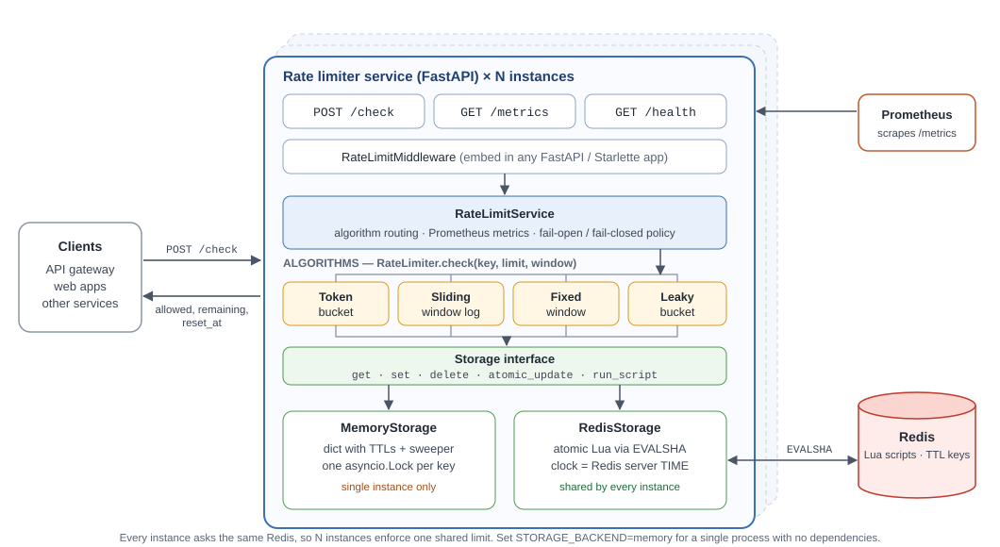

- **Four algorithms**, one `RateLimiter.check(key, limit, window)` interface. Each exists twice, as a pure
  Python function and as a Lua script, and a test feeds both the same random traffic and demands identical answers.
- **Correct under concurrency.** Four separate OS processes sharing one key admit *exactly* `limit` requests
  on every algorithm; a client-side `GET` then `SET` admitted 400 of 400 against a limit of 150
  ([why](#why-lua-scripts-for-redis)).
- **Fails safe.** If the store is down you choose: fail open (default; responses carry `degraded: true`) or fail closed (503).
- **Observable.** Prometheus metrics, a `/health` that reflects the store, and throttled error logs.
- **Measured.** Benchmarks, an overload experiment, and what broke while testing are all below, with the commands to reproduce them.
- **Tested.** 301 tests and 100% statement coverage, run against fakeredis *and* a real Redis 7.

| | |
|---|---|
| 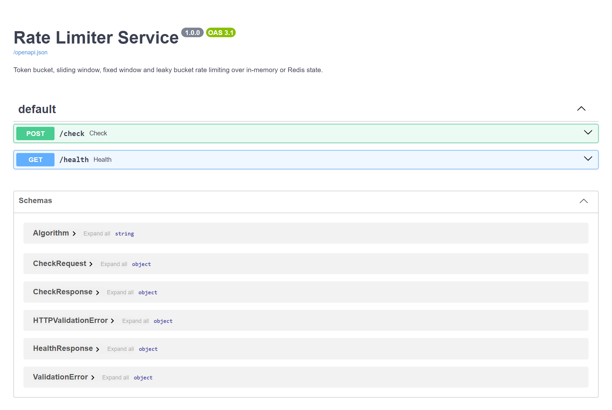 | 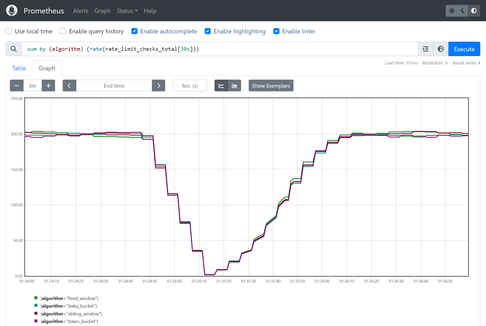 |

## Contents

[Quick start](#quick-start) · [API](#api) · [Using it as middleware](#using-it-as-middleware) · [Architecture](#architecture) ·
[Algorithms](#algorithms) · [Storage backends](#storage-backends) · [Benchmarks](#benchmarks) ·
[Design decisions](#design-decisions) · [Observability](#observability) · [Configuration](#configuration) ·
[Testing](#testing) · [What broke while testing](#what-broke-while-testing) · [Limitations](#limitations) · [Development](#development)

## Quick start

```bash
docker compose up --build          # rate limiter on :8000, Redis on :6379
```

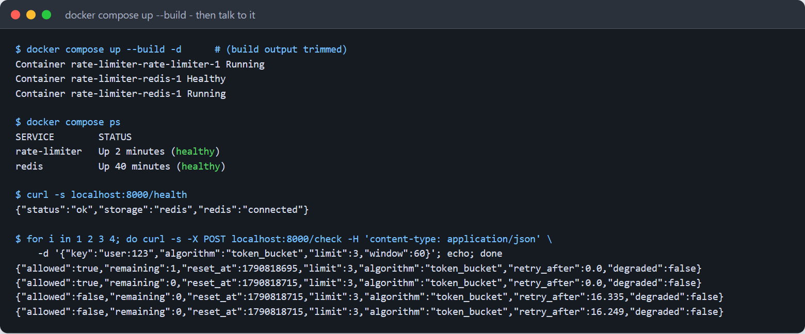

```bash
# allow 3 requests per minute for user:123, using the token bucket
curl -s -X POST localhost:8000/check -H 'content-type: application/json' \
  -d '{"key":"user:123","algorithm":"token_bucket","limit":3,"window":60}'
# {"allowed":true,"remaining":2,"reset_at":1790816239,"limit":3,"algorithm":"token_bucket","retry_after":0.0,"degraded":false}

curl -s localhost:8000/health      # {"status":"ok","storage":"redis","redis":"connected"}
curl -s localhost:8000/metrics     # Prometheus text format
```

Interactive docs are at <http://localhost:8000/docs>. Without Docker:

```bash
pip install -r requirements.txt
STORAGE_BACKEND=memory uvicorn src.main:app          # no Redis needed
```

Optional extras: `docker compose --profile monitoring up` adds Prometheus on :9090;
`docker compose --profile bench run --rm bench` runs the [benchmarks](#benchmarks).

## API

### `POST /check`

Counts one request against `key`. The answer is always HTTP 200 and `allowed` carries the verdict: this is a
decision API, and the caller (your gateway, your handler) decides what to do with a "no". The
[middleware](#using-it-as-middleware) turns a "no" into `429` for you.

| Field | | |
|---|---|---|
| `key` | required, 1-256 chars | What you are limiting: `user:123`, an API key, an IP. |
| `limit` | required, 1-10,000,000 | Requests allowed per `window`. |
| `window` | required, 1-2,592,000 s | Window length in seconds (up to 30 days). |
| `algorithm` | optional | `token_bucket`, `sliding_window`, `fixed_window`, `leaky_bucket`. Defaults to `DEFAULT_ALGORITHM`. |

Response:

| Field | Meaning |
|---|---|
| `allowed` | Whether this request is admitted. |
| `remaining` | Further requests that would be admitted right now. |
| `reset_at` | Unix time (s) when this key's quota is fully restored. |
| `retry_after` | Seconds until a request would be admitted. `0` when allowed. |
| `delay` | `leaky_bucket` only: seconds to hold an admitted request so output leaves at the drain rate. |
| `degraded` | `true` when the store failed and this is the fail-open default, not a real decision. |
| `limit`, `algorithm` | Echoed back. |

Invalid input (`limit: 0`, unknown algorithm, a misspelled field name, ...) is a `422`. A storage failure with
`FAIL_OPEN=false` is a `503` with `Retry-After: 1`.

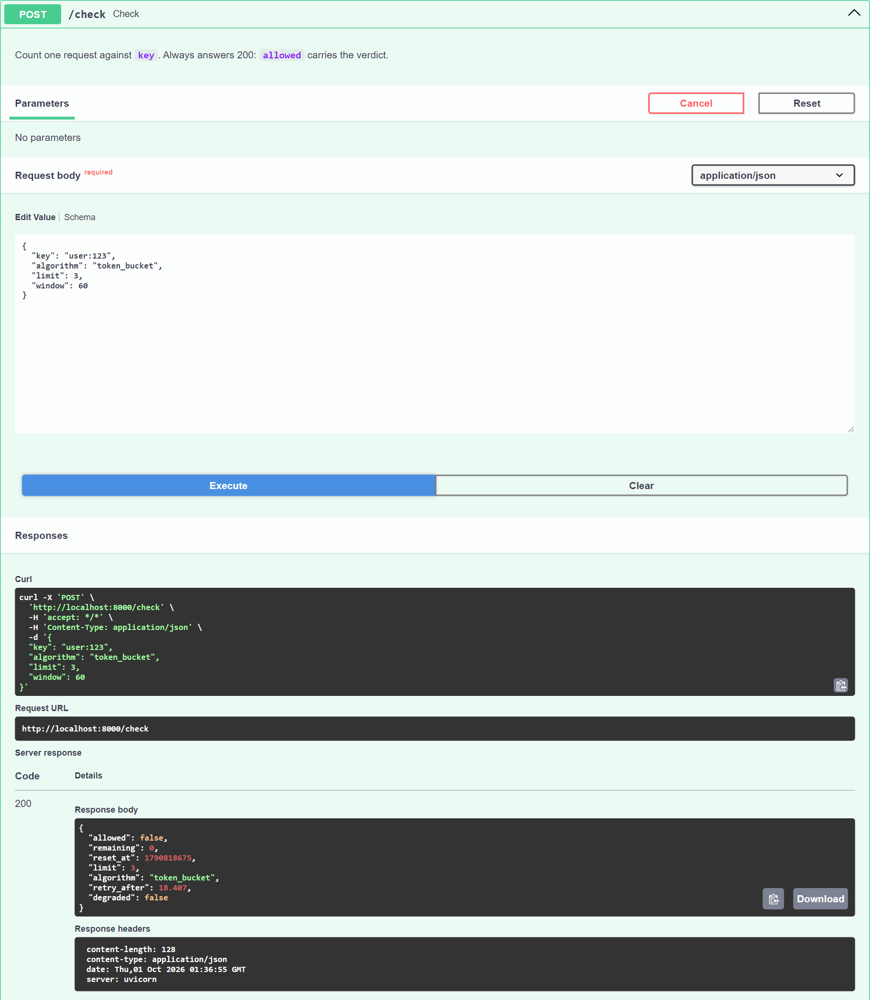

### `GET /health`

`200 {"status":"ok","storage":"redis","redis":"connected"}` while the store answers; `503 {"status":"degraded", ...,
"redis":"disconnected"}` when it does not. With `STORAGE_BACKEND=memory`, `redis` is `"not_configured"`.

### `GET /metrics`

Prometheus text format; see [Observability](#observability).

## Using it as middleware

```python
from fastapi import FastAPI
from src.middleware import RateLimitMiddleware, header_key
from src.service import RateLimitService
from src.storage import MemoryStorage          # or RedisStorage("redis://...")

storage = MemoryStorage()
service = RateLimitService.create(storage, default_algorithm="sliding_window")

app = FastAPI()
app.add_middleware(
    RateLimitMiddleware,
    service=service,
    limit=100, window=60,                       # 100 requests per minute...
    key_func=header_key("x-api-key"),           # ...per API key (falls back to the client IP)
)
```

Admitted responses gain `X-RateLimit-Limit`, `X-RateLimit-Remaining` and `X-RateLimit-Reset` headers; rejected
ones are `429` with `Retry-After`. `/health` and `/metrics` are exempt by default, and a `key_func` may return
`None` to exempt a request. It is plain ASGI middleware (no `BaseHTTPMiddleware`), so it adds no per-request task and does not buffer streaming responses.

Two things to do yourself: call `await storage.connect()` / `close()` from your app's lifespan (a bare middleware has
none), and pick the key deliberately. The default `client_ip_key` is the TCP peer, which behind a load balancer is
the *balancer*, so every user would share one bucket; key on a header your proxy sets and strips from client input.

## Architecture

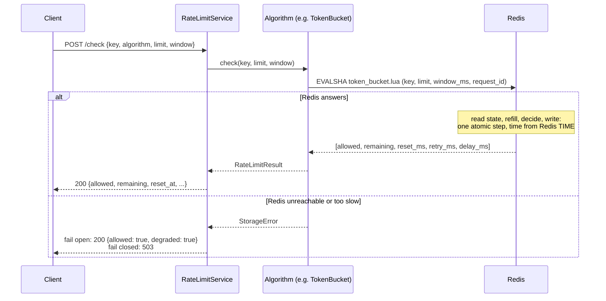

```
src/
├── main.py              FastAPI app factory, endpoints, lifespan
├── service.py           RateLimitService: algorithm routing + metrics + fail-open/closed policy
├── middleware.py        RateLimitMiddleware (ASGI) + key functions
├── algorithms/          RateLimiter base class + TokenBucket, SlidingWindowLog, FixedWindowCounter, LeakyBucket
├── storage/
│   ├── base.py          Storage interface + StorageError
│   ├── memory.py        dict + TTL sweeper + one asyncio.Lock per key
│   ├── redis.py         Lua scripts via EVALSHA, WATCH/MULTI generic path, connection pool
│   └── lua/             token_bucket.lua  sliding_window.lua  fixed_window.lua  leaky_bucket.lua
├── clock.py             MonotonicClock (production) and ManualClock (tests)
├── metrics.py           Prometheus registry
├── models.py            Pydantic request/response models
└── config.py            Settings from environment variables
```

An algorithm is two things: a **pure `transition(state, now, limit, window) -> (new_state, result)`** function that
runs on any backend through `Storage.atomic_update`, and a **Lua script** of the same name that Redis executes
server-side. `RateLimiter.check` picks the Lua path when the storage `supports_scripts`. A third-party backend
only has to implement five methods (`ping`, `get`, `set`, `delete`, `atomic_update`) to run all four algorithms; a test does
exactly that.

## Algorithms

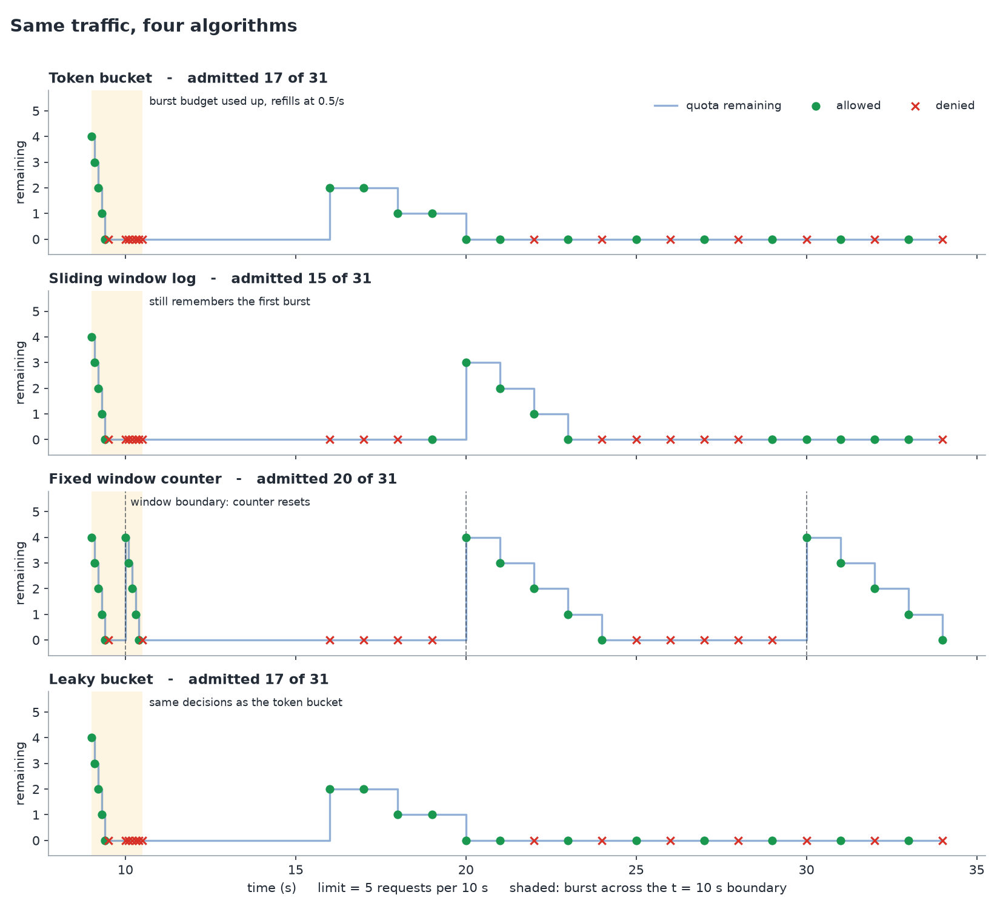

*The chart is drawn by running the real implementations on a manual clock (`python docs/generate_figures.py`).
Traffic: a burst of 6 just before t = 10 s, another just after, then 1 request/s: twice the sustainable rate of
5 per 10 s. Green = admitted, red cross = rejected, the blue line is the remaining quota.*

| | Token bucket | Sliding window log | Fixed window counter | Leaky bucket |
|---|---|---|---|---|
| **Idea** | `limit` tokens, refilled at `limit/window` per second | Remember every admitted timestamp | Count per aligned window | Pour in, drain at `limit/window` per second |
| **Bursts** | Up to `limit` at once, then the refill rate | None beyond `limit` per window | Up to `2 x limit` across a boundary | Up to `limit` queued, with a `delay` spreading them out |
| **Accuracy** | Exact for its model | Exact | Approximate near boundaries | Exact for its model |
| **State per key** | 2 numbers | `limit` timestamps | 1 counter | 2 numbers |
| **State at limit = 1000** | 128 B in Redis, ~300 B in memory | **89 KB** in Redis, 33 KB in memory | 96 B in Redis, ~370 B in memory | 128 B in Redis, ~380 B in memory |
| **Choose it when** | You want to allow bursts: the usual API default | You need a hard "N in any window" and `limit` is small | Cost matters more than boundary exactness | You are protecting something that wants steady input |

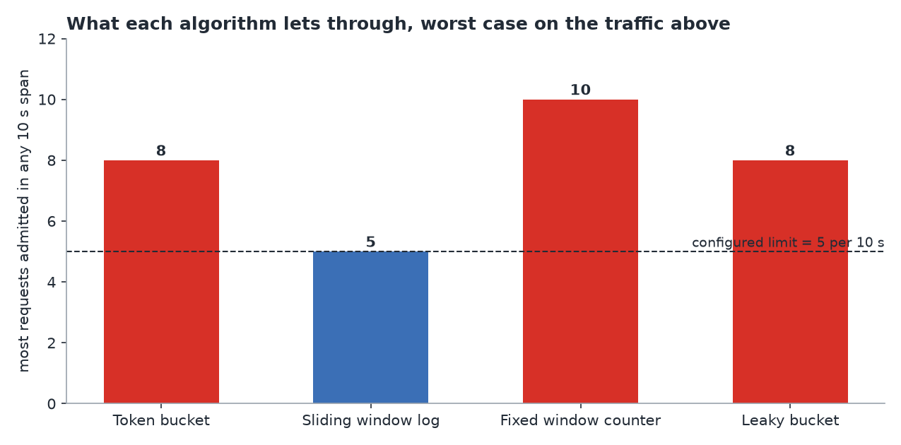

Details worth knowing:

- **Token bucket**: over any span of length *w*, at most `limit + (limit/window) x w` requests are admitted. The test
  suite checks that bound on random traffic. `reset_at` is when the bucket is full again.
- **Sliding window log**: denied requests are *not* logged, so a client hammering a closed gate does not
  extend its own lockout. Memory is O(`limit`) per key; do not use it with a limit of a million.
- **Fixed window**: a test (`test_boundary_burst_admits_twice_the_limit...`) pins the boundary burst down so nobody is
  surprised by it. Windows are aligned to multiples of `window`.
- **Leaky bucket** is implemented as a *meter with a delay output*. As a meter it makes the same admit/deny decisions as a token
  bucket (they are the same arithmetic seen from opposite sides, which a test asserts); what it adds is `delay`, so a
  caller that holds each admitted request for `delay` seconds emits traffic at a constant rate. If you ignore `delay` you
  have a token bucket that starts empty.

## Storage backends

Both implement `src/storage/base.py::Storage`, and the storage test-suite runs every assertion against each of them.

| | In-memory | Redis |
|---|---|---|
| **Scope** | One process. `N` replicas = `N` independent limits (a limit of 100 effectively becomes `100 x N`). | Shared by every instance and process. |
| **Atomicity** | One `asyncio.Lock` per key (created on demand, dropped when idle). | One Lua script per decision, executed atomically by Redis. |
| **Clock** | Process-local monotonic clock. | Redis server `TIME`: every instance agrees, whatever their own clocks say. |
| **Latency** | ~7 µs per decision. | One network round trip: ~0.36 ms p50, 0.8 ms p99 inside Docker (see [benchmarks](#benchmarks)). |
| **Failure modes** | None beyond the process. Restart = counters reset. | Redis down/slow: [fail open or closed](#fail-open-vs-fail-closed). Redis restart = counters reset. |
| **Memory** | Grows with distinct keys until TTL expiry (a background sweeper reclaims idle ones). No cap. | Bounded by `maxmemory`; compose sets `volatile-ttl` eviction. |
| **Use it for** | Tests, one-box deployments, a per-process cache in front of Redis. | Anything with more than one instance. |

## Benchmarks

Everything below was measured on one machine: an AMD Ryzen 9 7940HX laptop (16 cores / 32 threads, 15 GB), Windows 11, with the
service, Redis 7.4 and the load generator all running as Docker Desktop (WSL2) containers on the same compose network,
Python 3.12 + uvloop, **one uvicorn worker**. These are laptop numbers, good for comparing algorithms and spotting
bottlenecks, **not** capacity planning for your hardware. Raw output is in [`docs/benchmarks/`](docs/benchmarks); every command
is reproducible with `docker compose --profile bench run --rm bench ...`.

### 1. What one decision costs (no load)

`benchmarks/idle_latency.py`: 5,000 strictly sequential checks per algorithm, nothing else running.

| | In-memory | Redis (Lua over the Docker network) |
|---|---:|---:|
| p50 | **7-8 µs** | **0.35-0.37 ms** |
| p95 | 9-22 µs | 0.53-0.60 ms |
| p99 | 21-35 µs | 0.76-0.82 ms |

A Redis decision is one network round trip plus a few microseconds of Lua. Memory is ~50x faster but cannot be shared.

### 2. The four algorithms head to head

`benchmarks/compare.py`: 100 concurrent workers hammer one backend from one process for 60 s per algorithm (after a 2 s warm-up),
1,000 keys, limit 50 per 10 s. Each configuration was run once, so differences of a few percent are noise.

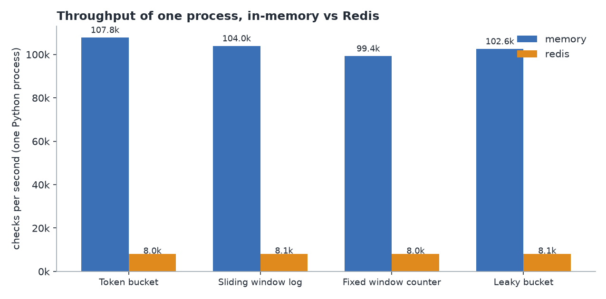

| Backend | Algorithm | Checks/s | p50 | p95 | p99 | Allowed | State per key at limit = 1000 |
|---|---|---:|---:|---:|---:|---:|---:|
| memory | `token_bucket` | 107,787 | 8 µs | 13 µs | 27 µs | 4.6% | 294 B |
| memory | `leaky_bucket` | 102,640 | 8 µs | 13 µs | 29 µs | 4.9% | 376 B |
| memory | `fixed_window` | 99,378 | 8 µs | 14 µs | 31 µs | 5.0% | 374 B |
| memory | `sliding_window` | 103,970 | 8 µs | 13 µs | 29 µs | 4.8% | **33,165 B** |
| redis | `token_bucket` | 8,018 | 13.4 ms | 18.7 ms | 23.2 ms | 71.0% | 128 B |
| redis | `leaky_bucket` | 8,052 | 13.4 ms | 18.4 ms | 22.9 ms | 70.6% | 128 B |
| redis | `fixed_window` | 8,026 | 13.6 ms | 19.4 ms | 23.6 ms | 62.6% | 96 B |
| redis | `sliding_window` | 8,084 | 13.4 ms | 18.2 ms | 22.0 ms | 59.5% | **89,016 B** |

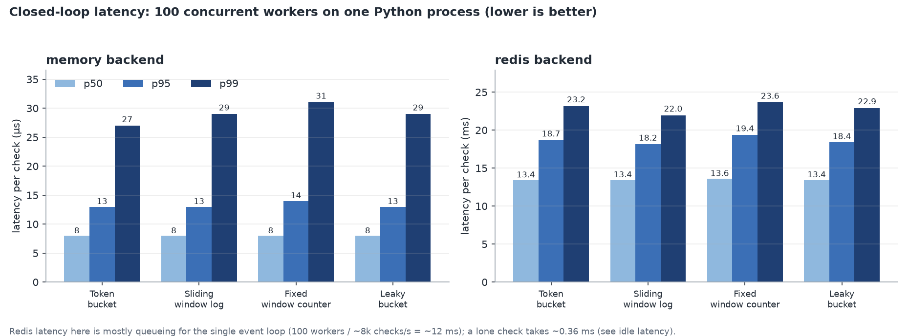

How to read this:

- **The algorithm barely affects speed.** Within each backend all four are within ~8% of each other, and some of that is noise. Choose on behaviour and memory, not speed.
- **Memory is where they differ.** The sliding window log costs 89 KB per key in Redis at a limit of 1000 (about 89 bytes per remembered request) against ~100 bytes for the others, nearly **700x** more. Memory-backend numbers are Python object sizes (tracemalloc), so they are larger for the small states.
- **The Redis latencies are mostly queueing, not Redis.** 100 workers share one Python event loop doing ~8k checks/s, so Little's law gives ~100 / 8,000 = 12.5 ms per check; a lone check takes 0.36 ms (table 1). Redis itself sat at under 10% CPU. The ~8k/s is the *client process* ceiling, which is why a deployment scales by adding processes.
- The "Allowed" column differs between backends only because the memory backend is ~13x faster and therefore exhausts each key's limit sooner. Compare algorithms within a backend.

### 3. End to end over HTTP: 1000 concurrent users

`locust -u 1000 -r 100 -t 70s --reset-stats` from a Linux container against the compose stack (Redis backend, one worker). Users ramp at 100/s;
`--reset-stats` discards the ~10 s ramp, so this is 60 s of steady state at about **1,000 requests/s with 0 failures** (60,524 requests; each user thinks 0.5-1.5 s between requests;
the four algorithms are interleaved so they share identical conditions).

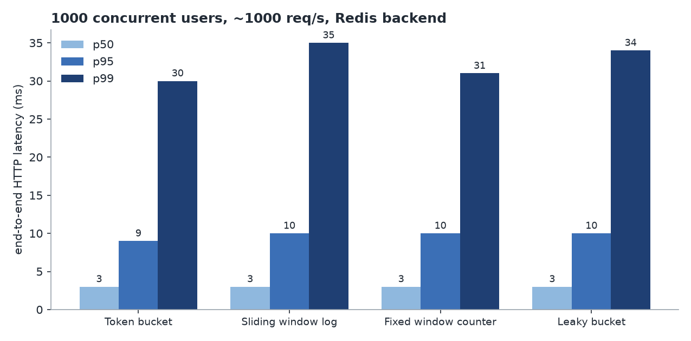

| Algorithm | Requests | p50 | p95 | p99 |
|---|---:|---:|---:|---:|
| `token_bucket` | 15,026 | 3 ms | 9 ms | 30 ms |
| `leaky_bucket` | 15,209 | 3 ms | 10 ms | 34 ms |
| `fixed_window` | 15,229 | 3 ms | 10 ms | 31 ms |
| `sliding_window` | 15,060 | 3 ms | 10 ms | 35 ms |
| **all** | **60,524** | **3 ms** | **10 ms** | **33 ms** (max 215 ms) |

Again the algorithms are indistinguishable. The p99 is queueing in the one event loop when many of the 1000 users' requests land together.

### 4. Where one worker tops out

With no think time (users fire the next request immediately), a single uvicorn worker saturates at roughly **1.8-1.9k requests/s**: the service container sits at
100% of one core while Redis is at ~9%. Past that point latency climbs and, because the Redis pool wait times out under a saturated event loop, the service starts failing open
(see [What broke](#what-broke-while-testing), item 6). **I did not measure horizontal scaling**: my 4-worker runs showed no gain, because the load generator and keep-alive connection
distribution were the limit, so I make no claim beyond the single-worker ceiling. The design (shared Redis state, atomic scripts) is what makes adding workers or instances *correct*;
how well they scale on your hardware is yours to measure.

Reproduce:

```bash
docker compose up -d                                               # service + Redis
docker compose --profile bench run --rm bench python benchmarks/idle_latency.py --redis-url redis://redis:6379/0
docker compose --profile bench run --rm bench python benchmarks/compare.py --backend both --redis-url redis://redis:6379/0
docker compose --profile bench run --rm bench locust -f benchmarks/locustfile.py \
    --headless -u 1000 -r 100 -t 70s --reset-stats --host http://rate-limiter:8000
```

`locustfile.py` also takes `ALGORITHM`, `LIMIT`, `WINDOW`, `KEYS` and `THINK_TIME` environment variables (see its docstring), and
`benchmarks/locust_report.py` turns Locust's `--csv` output into a markdown table.

## Design decisions

### Why Lua scripts for Redis

A rate-limit decision is read-modify-write. Done from the client (`GET` the counter, compare, `SET` it back) it has a
race: with several in-flight requests, all of them read the old value before any writes the new one. I measured it:
the same workload (4 processes x 100 concurrent requests, limit 150) through a naive client-side limiter admitted
**400 of 400 requests in all 3 runs**; through the Lua scripts it admits **exactly 150 on all four algorithms**
(`tests/test_distributed.py`, which needs a real Redis).

A Lua script executes atomically inside Redis: nothing else runs between its read and its write, regardless of how many
app instances call it. It is also one round trip instead of two or three. Scripts are loaded at startup
(`SCRIPT LOAD`) and invoked by hash (`EVALSHA`), and if Redis restarts or flushes its script cache the first call gets
`NOSCRIPT`, reloads, and carries on (tested). A `WATCH`/`MULTI` optimistic transaction backs the generic `atomic_update`
for algorithms that have no script, but it retries under contention, which is exactly why the built-in ones do not use it.

Requires Redis 5.0+ (writes after `TIME` in a script). The fixed-window script builds its key name
(`<key>:<window_start>`) inside the script; on Redis Cluster, wrap your logical key in a `{hash tag}` so all of them
land on one slot.

### Why a monotonic clock, and whose clock

- **In memory**: `MonotonicClock` reads `time.time()` once at startup to anchor the scale, then only ever adds
  `time.monotonic()`. NTP steps, manual clock changes or a resumed VM cannot make a bucket refill negatively or a
  window reopen early. `reset_at` is still a real-looking unix time.
- **In Redis**: the script reads `TIME` from the Redis server. Monotonic time is per-process and meaningless across hosts,
  and app-server wall clocks disagree by milliseconds to seconds. One clock for everyone removes the problem; clients
  never send timestamps.
- **If the clock does step backwards** (e.g. a failover to a replica whose clock is behind), the buckets re-anchor to the
  new "now" instead of refilling a negative amount or stalling until the old time is reached again. The price is a
  one-off over-credit of at most the size of the step; the alternative is a stall as long as the step. Tested.
- Scripts work in whole milliseconds with a `1e-9` epsilon for float dust, and a test checks the Python and Lua versions agree to
  the millisecond.

### Fail-open vs fail-closed

When the store is unreachable the limiter must pick between two bad options:

| | Fail open (default, `FAIL_OPEN=true`) | Fail closed (`FAIL_OPEN=false`) |
|---|---|---|
| During an outage | Everyone is admitted; limits are not enforced. | Everyone is rejected (`503`). |
| Blast radius | The thing you were protecting may get more load than planned. | Your own API is down because a dependency of your protection is down. |
| Right for | General API protection, fairness quotas, anything where a brief overload is survivable. | Security-sensitive limits: login/OTP/SMS brute-force protection, expensive or paid operations. |

The default is open because a rate limiter is a protective optimisation, not part of correctness, and it should not be a
single point of failure for the service it guards. To keep "open" from being "silently broken":

- every fail-open answer says `"degraded": true` (and `X-RateLimit-Degraded: true` from the middleware);
- `rate_limit_errors_total{algorithm,policy}` counts them, and `/health` goes `503`, so you can alert on it;
- Redis timeouts are tight (`REDIS_SOCKET_TIMEOUT`, 250 ms): a refused connection fails immediately and a black-holed one costs at most 250 ms per request, not the many seconds of a default socket timeout;
- errors are logged at most every 5 seconds with a suppressed-count, not once per request;
- the service **starts** even if Redis is down, and recovers by itself when it returns (tested mid-flight).

Overload is where this bites: see [What broke](#what-broke-while-testing).

### Smaller decisions

- **Denied requests do not consume quota** (sliding log, fixed window) so an abusive client cannot extend its own lockout by retrying.
- **`/check` returns 200 for "denied"**: it is a decision service. The middleware returns `429`.
- **`transition` is a pure function** and the clock is injected, so every edge case (empty bucket, full bucket, clock skew, boundary burst) is a deterministic test with no sleeps.
- **Metric labels are `algorithm` only.** Never the key: a series per user would take Prometheus down before it took the limiter down.
- **Connection pool applies back-pressure.** Callers beyond `REDIS_MAX_CONNECTIONS` wait up to the timeout for a connection rather than erroring.

## Observability

| Metric | Type | Labels | |
|---|---|---|---|
| `rate_limit_checks_total` | counter | `algorithm` | Decisions made. |
| `rate_limit_allowed_total` | counter | `algorithm` | ...that admitted the request. |
| `rate_limit_denied_total` | counter | `algorithm` | ...that rejected it. |
| `rate_limit_latency_seconds` | histogram | `algorithm` | Decision time including the storage round trip; buckets from 50 µs to 1 s. |
| `rate_limit_errors_total` | counter | `algorithm`, `policy` | Storage failures, by the policy applied (`open`/`closed`). |

All series exist at `0` from startup, so `rate()` queries work before the first request.

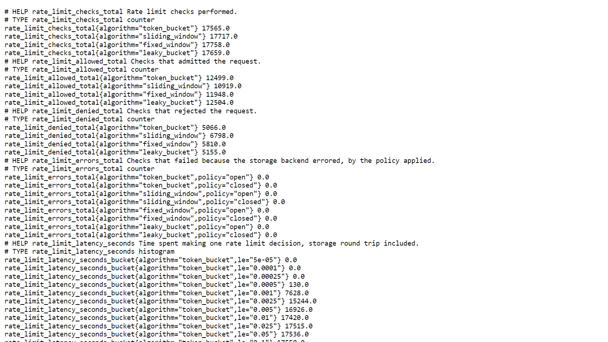

`docker compose --profile monitoring up` starts Prometheus (scraping `/metrics` every 5 s) at <http://localhost:9090>:

Checks per second by algorithm, during a ramp to 800 users:


Allowed vs denied, as the load pushes keys over their limit (about 40% denied at the plateau):

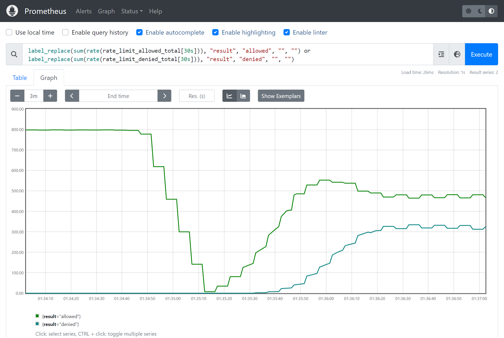

p99 decision latency from the histogram (coarse: Prometheus interpolates inside the 5-10 ms and 10-25 ms buckets, so use the benchmarks above for exact figures):

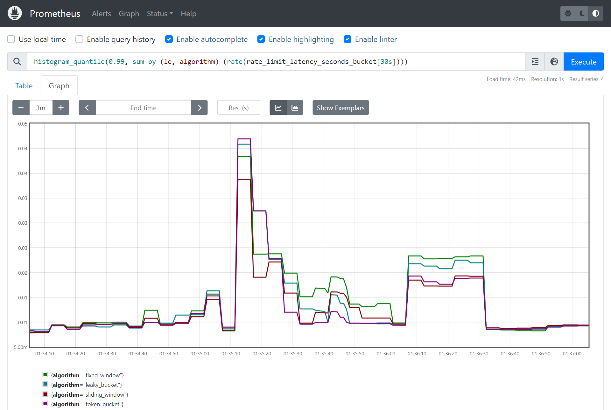

Useful queries:

```promql
sum by (algorithm) (rate(rate_limit_checks_total[1m]))                                   # throughput
sum(rate(rate_limit_denied_total[1m])) / sum(rate(rate_limit_checks_total[1m]))          # deny ratio
histogram_quantile(0.99, sum by (le) (rate(rate_limit_latency_seconds_bucket[1m])))      # p99 decision latency
sum(rate(rate_limit_errors_total[1m])) > 0                                               # alert: storage failing
```

## Configuration

| Variable | Default | |
|---|---|---|
| `STORAGE_BACKEND` | `memory` | `memory` or `redis`. (`docker-compose.yml` sets `redis`.) |
| `REDIS_URL` | `redis://localhost:6379/0` | Used when the backend is `redis`. |
| `DEFAULT_ALGORITHM` | `token_bucket` | Used when a request names no algorithm. |
| `LOG_LEVEL` | `INFO` | `DEBUG`, `INFO`, `WARNING`, `ERROR`, `CRITICAL`. |
| `FAIL_OPEN` | `true` | Storage failure policy; see [above](#fail-open-vs-fail-closed). |
| `REDIS_SOCKET_TIMEOUT` | `0.25` | Seconds. Connect, command and pool-wait timeout. |
| `REDIS_MAX_CONNECTIONS` | `100` | Pool size per process. Size it to your peak in-flight checks. |
| `WEB_CONCURRENCY` | `1` | uvicorn worker processes. With the memory backend each worker has *its own* counters. |

Copy `.env.example` to `.env` to set them in a file.

## Testing

```bash
pip install -r requirements-dev.txt
pytest tests -v --cov=src                           # fakeredis (real Lua engine), no server needed

docker compose up -d redis                          # also run everything against a real Redis 7
TEST_REDIS_URL=redis://127.0.0.1:6379/15 pytest tests --cov=src
```

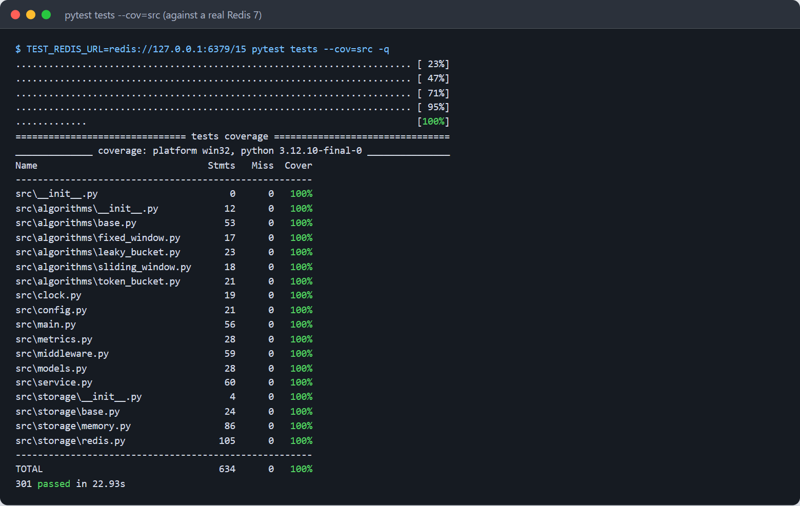

| File | What it pins down |
|---|---|
| `test_algorithms.py` | Every edge case per algorithm (empty bucket, full bucket, idle cap, partial refill, **clock stepping backwards**, boundary burst, exact eviction instant, denied-don't-count); properties that must hold under random traffic (never exceed the theoretical maximum); **200 concurrent checks admit exactly 50**; the **Python and Lua implementations agree** on 500 random steps. Parametrized over every backend. |
| `test_storage.py` | One contract suite run on memory, fakeredis and real Redis (roundtrip, TTL, atomic update under concurrency, errors); lock table empties when idle; script cache flush recovery; Redis outage at startup and mid-flight; pool exhaustion regression; a minimal third-party backend runs all four algorithms. |
| `test_api.py` | Endpoints, validation (422s), metrics counters, health, fail-open/closed, settings, the middleware (headers, 429, exemptions, key functions, fail policies). |
| `test_distributed.py` | Real Redis only: **4 separate OS processes share one limit** and admit exactly `limit`. |

The `real_redis` tests are skipped, not faked, when `TEST_REDIS_URL` is unset.

## What broke while testing

Kept in because the failures taught more than the passes.

1. **A burst past the Redis pool size became a silent fail-open.** redis-py's default pool is capped at 100
   connections and *raises* when exhausted. The real-Redis run of the 200-concurrent-checks test failed with
   `MaxConnectionsError`, which the service would have turned into "allow everything". Fixed with a
   `BlockingConnectionPool` (callers queue up to the timeout) and a `REDIS_MAX_CONNECTIONS` setting; regression test added.
2. **A plain `def` FastAPI dependency cost more than the rate-limit decision.** Profiling the ASGI app showed
   `run_sync_in_worker_thread` and lock acquisition on top: FastAPI runs sync dependencies in a thread pool, and
   `get_service` only read an attribute. Making it `async def` took the app from **687 µs to 417 µs per request (+65% throughput)**.
3. **An empty `MemoryStorage` is falsy.** It defines `__len__`, so `storage or build_storage(...)` silently discarded an
   injected backend. An API test caught it; the app now uses `is not None`.
4. **My first benchmarks measured the wrong thing.** From a Windows host through Docker Desktop's port proxy, Locust
   reported a 22 ms median; the same test from a Linux container on the compose network gave 12 ms; after fix 2, 3 ms.
   The load generator now lives in the compose network (`docker compose --profile bench ...`), and the README
   says where each number was taken.
5. **Float dust vs millisecond rounding.** A random-traffic test advanced the clock by `0.1` s steps; accumulated float error put one
   timestamp at 9.9999999999 s, which the whole-millisecond Lua script correctly rounds to a new window while the test's
   float arithmetic did not. The test now uses exactly representable steps, with a comment explaining why.
6. **Overload turns into fail-open.** With 600 closed-loop users and no think time against *one* uvicorn worker (past its
   ~1.8k req/s ceiling), the service container was at 100% of a core (Redis at ~9%) and **roughly 22-25% of answers came back
   `degraded: true`** across three runs. The logged error was a bare `ConnectionError`: the 250 ms wait for a pooled connection expired
   while the saturated event loop could not service the pool in time. That is the designed behaviour, and the `degraded` flag, the
   `rate_limit_errors_total` counter and the throttled log line made it obvious, but it shows that fail-open can mask overload: alert on that counter
   (the logged error text is now more descriptive). I also tried 4 workers and saw no improvement in that test, so I have *not* established
   horizontal-scaling numbers: the load generator and keep-alive connection distribution were the limit, not the service.

## Limitations

- **One Redis is one failure domain and one hot spot.** No sentinel/cluster handling is built in beyond hash-tag guidance.
- **Memory backend has no key cap.** TTLs and a sweeper bound it by *time*, not by count; a flood of distinct keys within one window is not bounded.
- **Sliding window log is O(limit) per key**; the state-size table shows what that costs.
- **`POST /check` is unauthenticated.** Put it behind your network boundary or gateway.
- **`reset_at` is a hint**, quantised to whole seconds in the API and computed from the store's clock.
- Not implemented (stretch goals from the brief): gRPC, sliding-window-counter hybrid, tiered limits, pub/sub invalidation, Terraform.

## Development

```bash
python -m venv .venv && . .venv/bin/activate          # Windows: .venv\Scripts\activate
pip install -r requirements-dev.txt
pytest tests -q
ruff check .                                           # lint (config in ruff.toml)

python benchmarks/compare.py --duration 10            # algorithm comparison, in-process
pip install -r requirements-docs.txt
python docs/generate_figures.py                       # charts from the real code + saved benchmark output
python docs/generate_screenshots.py                   # screenshots of the running stack (see its docstring)
```

The original project brief is kept in [`docs/PROJECT.md`](docs/PROJECT.md).
